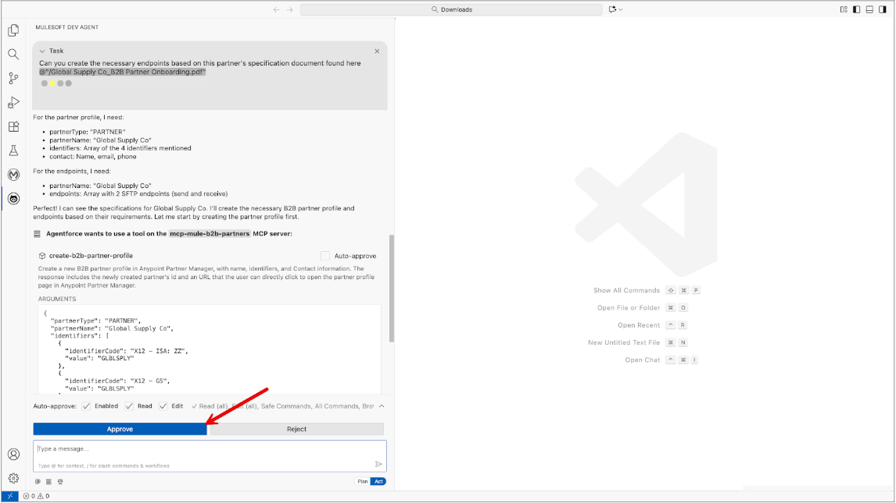
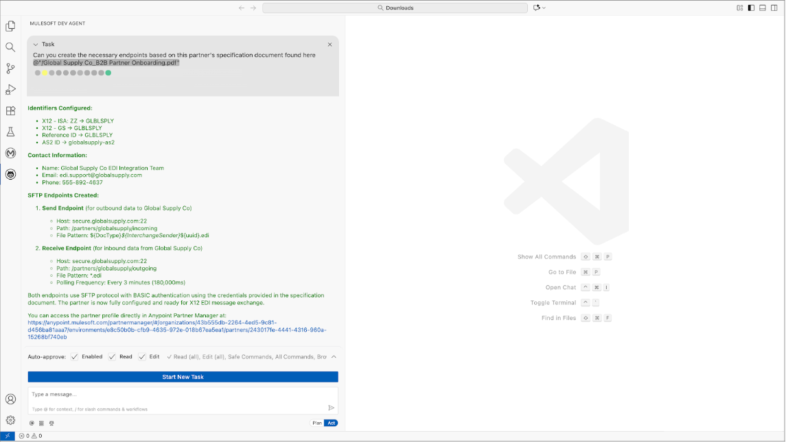

# Create endpoints tool

 - This tool receives information about endpoints and creates the configurations in Partner Manager.
 - At this time only SFTP Receive and Send endpoint configurations are supported

## Example user experience

