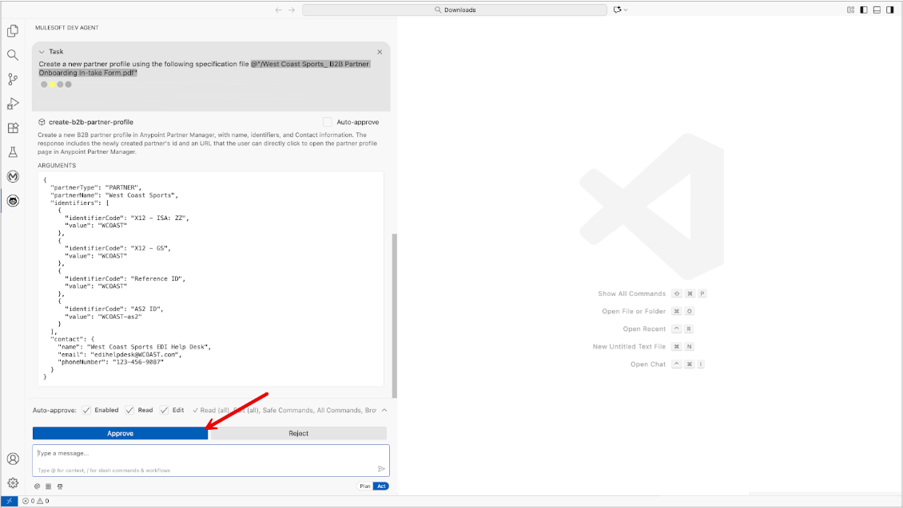
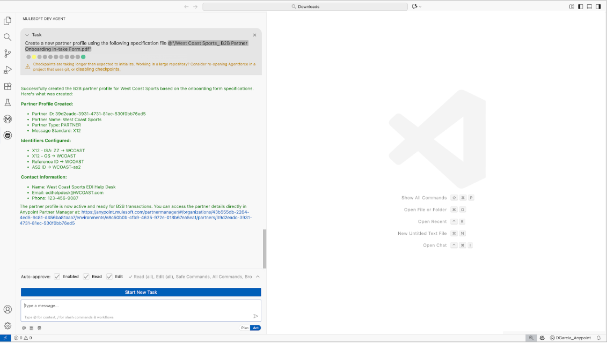

# Create partner profile tool

 - This tool receives requests from AI clients to create a new partner profile in Anypoint Partner Manager.
 - The user provides the name of the partner, their identifiers and contact information.
 - The tool transforms the information into the request structure of Partner Manager's platform API to create the partner profile.

## Example user experience

