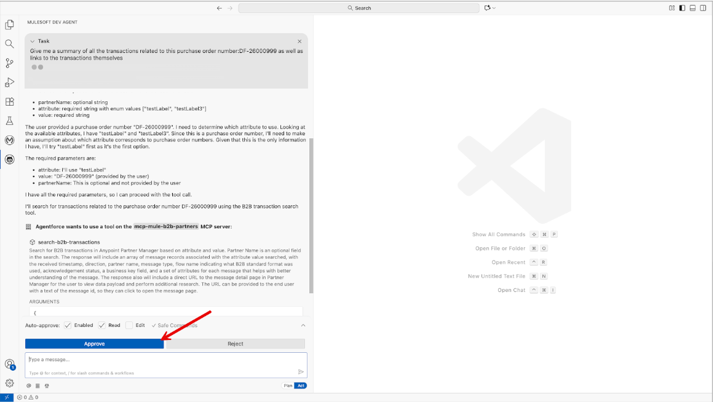
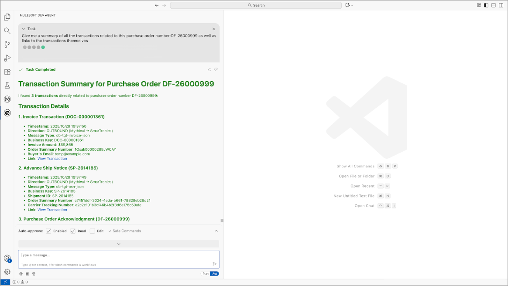

# Search B2B Transactions

- This tool receives a specific message attribute such as a Purchase Order Number, Invoice Number, or any configured custom message attribute in your Partner Manager environment, and searches for all transactions associated with that attribute.
- AI clients can interpret the tools responses to provide rich insights to the users based.

## Example user experience

