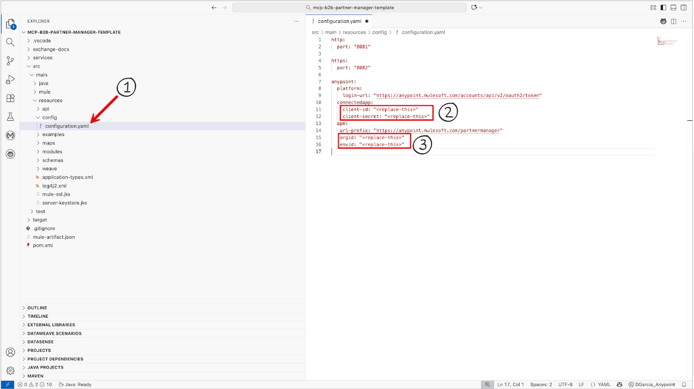

## Connected App

Prior to using these utility applications, you need to create a connected app with appropriate scopes allowing interaction with the Anypoint Partner Manager platform APIs.

## Update configuration.yaml

- From the connected app created earlier, copy the client-id and client-secret into the appropriate fields within the config/configuration.yaml file.
- Be sure to also update the orgid and envid fields with the correct values.
- Note: Before deploying to production environments `client-secrets` should be stored as encrypted values in configuration properties file.



## Custom message attributes

- Make a platform API call to the API endpoint '[https://anypoint.mulesoft.com/partnermanager/partners/api/v1/organizations/{orgId}/environments/{envId}/customAttributes?page=1&pageSize=200&searchable=true](https://anypoint.mulesoft.com/partnermanager/partners/api/v1/organizations/{orgId}/environments/{envId}/customAttributes?page=1&pageSize=200&searchable=true)'
- From Dataweave playground ([https://dataweave.mulesoft.com/learn/dataweave](https://dataweave.mulesoft.com/learn/dataweave)), apply the below transformation to get the list of all attribute labels.

```
%dw 2.0
output application/json
---
payload.label
```
- Update the 'Parameters schema' field of the MCP Tools Listener configuration for 'search-b2b-transactions', with the list of attribute labels in the enum list, replacing the existing attributes list provided with the template.
- This ensures that the AI Client can pass in the appropriate attribute name in the request to the MCP tool, for it to be translated to its equivalent UUID to perform the search via Partner Manager platform API.

## SSE Server Configuration

Users can optionally configure their MCP connection as an SSE Server instead of the default Streamable HTTP Server. This setup is recommended when the connected AI client does not support Streamable HTTP.

To ensure successful connectivity when configured as an SSE server, complete the following steps:

**Install Node.js and npm**
 - Both Node.js and npm are required, as they provide the runtime environment and tooling necessary to execute the supergateway command.
 - Mac users: Installation via Homebrew is recommended.

**Understand the configuration**
 - This setup instructs the system to use npx (included with npm and powered by Node.js) to run the supergateway utility.
 - The utility acts as a bridge which converts MCP communication from a remote SSE endpoint into a local stdio (Standard Input/Output) stream, allowing local clients to connect.

**Verify installation**
 - Open a command prompt or terminal and run:

```
node -v
npm -v
```

**Minimum version requirements**
 - Node.js: 16+ (recommended: 18 LTS or 20 LTS for stability and long-term support)
 - npm: 8+

**Configure AI client**
 - In an  AI client of your organization's choice, configure the MCP server configuration using the following

```
{
  "mcpServers": {
    "b2b-sse": {
      "command": "npx",
      "args": [
        "-y",
        "supergateway",
        "--sse",
        "https://<your-app-base-url>/sse"
      ]
    }
}
```
