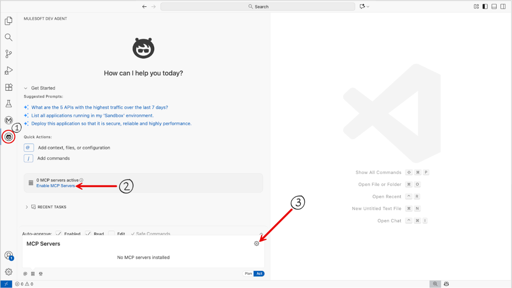
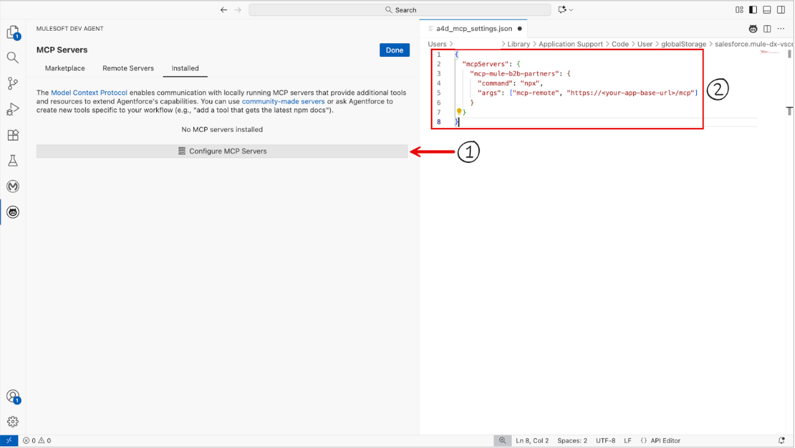
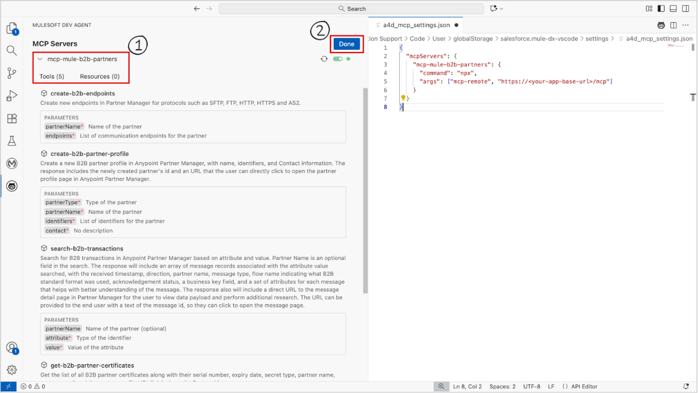

# **EDI Agent Template for Anypoint Partner Manager**

## Overview

This template provides a suite of MCP (Model Context Protocol) Tools that enable organizations to implement agentic AI for streamlined B2B partner onboarding and intelligent transaction search.

This template provides the following tools:
 - Create partner profiles
 - Create partner endpoint configurations (SFTP protocol)
 - Get all partner profiles
 - Get all certificates and keys
 - B2B Transaction search by partner name or message attribute

## Using the template

- Follow the instructions in `Prerequisites` to prepare your environment to use this template.
- Go through the details of each included MCP tool, and adjust the implementation as necessary to implement experiences your internal teams or partners need.
- When deploying, ensure that Object Store V2 and Last-Mile Security are enabled
- In the AI client of your choice, configure the MCP server using your application endpoint URL, as shown below:

```
{
  "mcpServers": {
    "mcp-mule-b2b-partners": {
      "command": "npx",
      "args": ["mcp-remote", "https://<your-app-base-url>/mcp"]
    }
  }
}
```

- Upon successful connection, you will see the MCP server show up in your AI Client as an available server.



